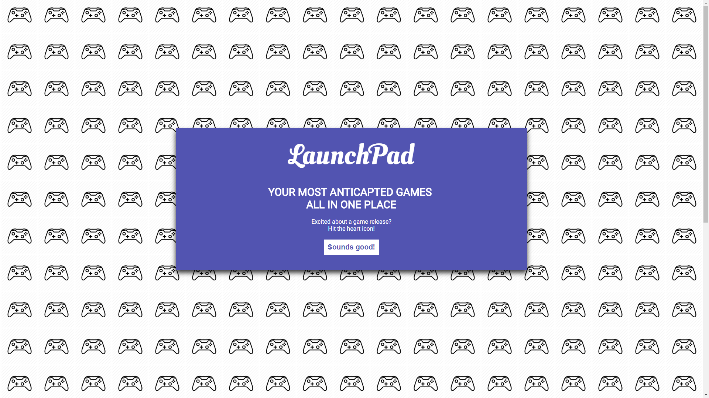
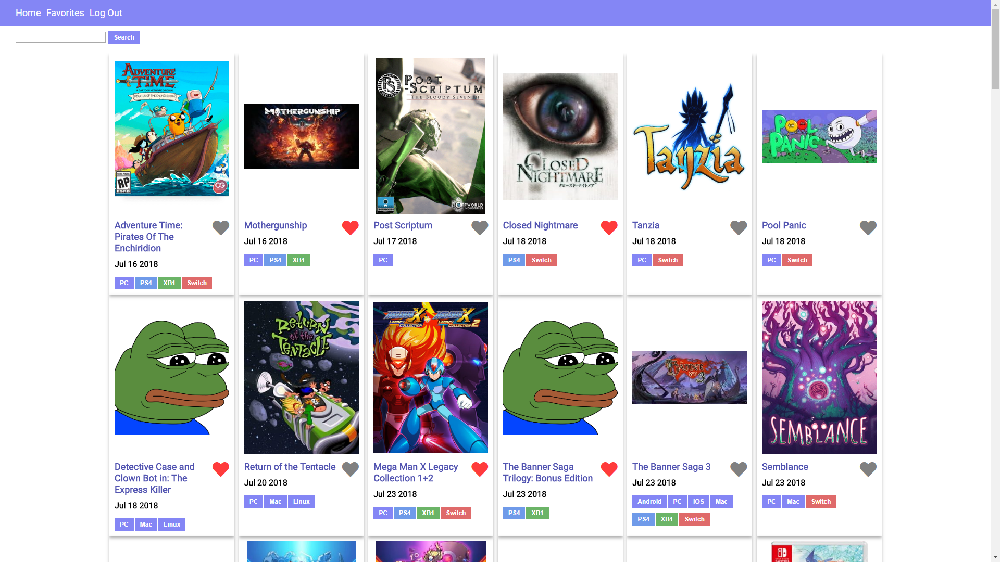
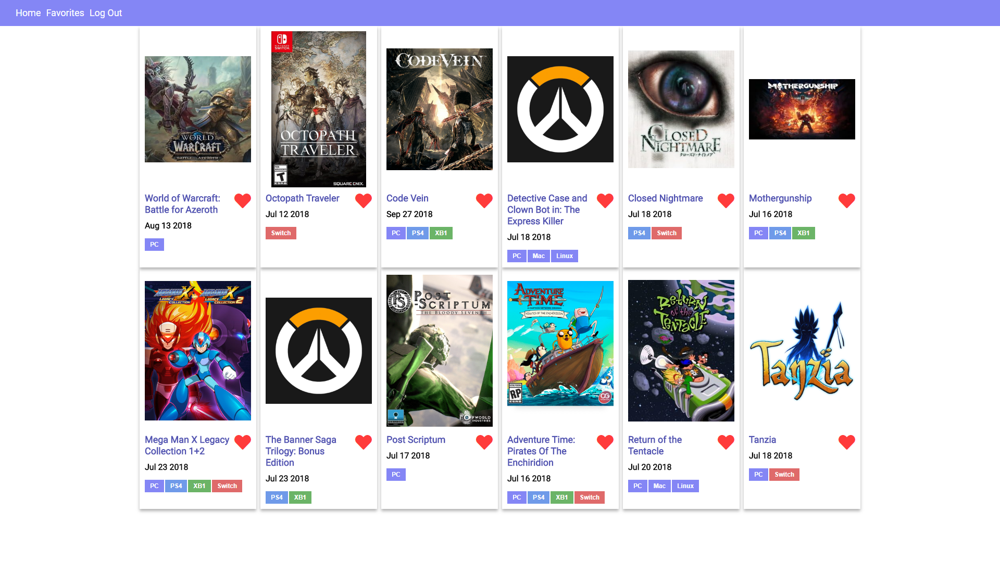
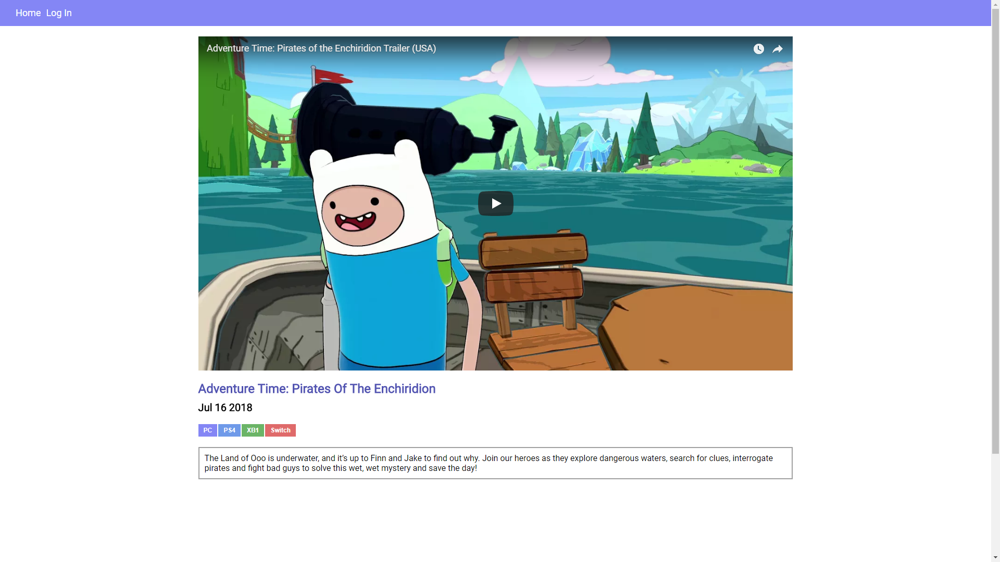
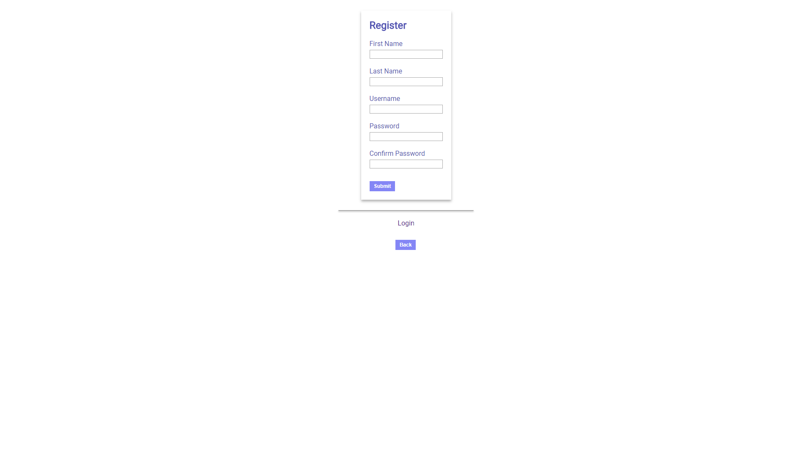
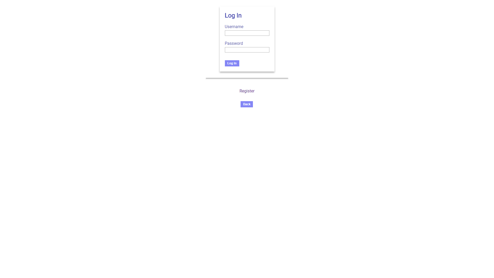

# LaunchPad.gg

### LaunchPad is a simple webapp that displays all future video game releases
A webapp designed to spotlight upcoming video game release dates. Building value for users by providing one singular source with a clean and simple interface *(without all the noise and ads of general video game websites)* to view and track the games they're most excited for.

### The goals for LaunchPad is to:
1) Spotlight upcoming video game release dates
2) Enable users to track their most anticipated games by favorite-ing them
3) Get users excited by displaying trailers, screenshots and recent news surrounding their favorite upcoming games

### Live
[LaunchPad.gg](https://mysterious-sands-19667.herokuapp.com/ "LaunchPad.gg")

### Server Repo
[LaunchPad Server Repo](https://github.com/gyuhankim/launchpad-server "LaunchPad Server Repo")

### Tech Stack
#### Frontend:
* **React/Redux**

#### Backend:
* **NodeJS**
* **ExpressJS**
* **MongoDB**

### React Components
#### (All components can be found in the Components directory)
* Nav.js => Top bar containing nav links
* Toolbar.js => Displays search bar and updates state with the input value
* GameList.js => Main view containing logic for fetching games from DB, filtering and processing of fetched games and infinite scroll logic
* GamePage.js => View for a single game containing YouTube embed(s) of trailers and game description
* LoginPage.js => Responsible for displaying LoginForm.js
* LoginForm.js => Handles form submission, user authentication w/ JWTs and secure, hashed and salted password entry
* RegistrationPage.js => Responsible for displaying RegistrationForm.js
* RegistrationForm.js => Handles form submission, POSTs new user to backend and secure, hashed and salted password entry
* Onboarding.js => Initial user onboarding splash screen
* FavoritesList.js => Contains similar features to GameList.js but filters by current user's favorites

# Screenshots

## User Onboarding

## Game List View

## Game List View 2

## Favorites List

## Game Detail View

## Registration Page

## Login Page

